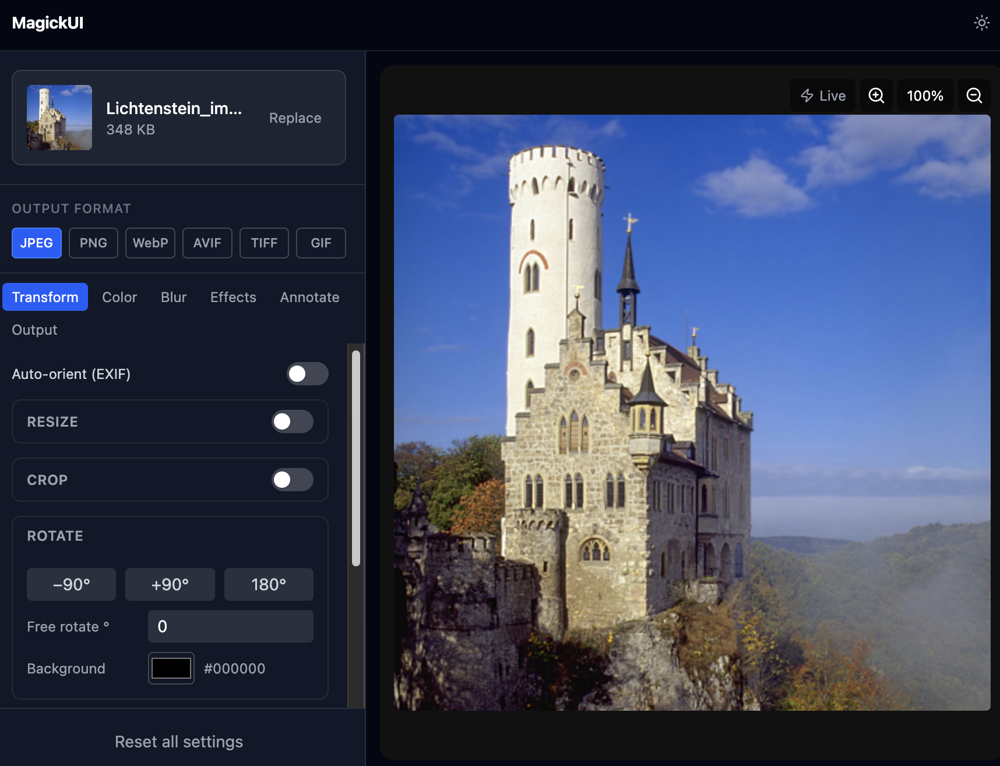

# MagickUI

A browser-based image processing tool powered by [@imagemagick/magick-wasm](https://www.npmjs.com/package/@imagemagick/magick-wasm). Upload an image, apply transforms, color corrections, effects, and annotations, then download the result — entirely in the browser. Images never leave your device.

## Privacy

All image processing runs locally in your browser via WebAssembly. **No image data is ever uploaded or sent to any server.** The app is served as a static site (HTML + JS + wasm); once loaded, it works entirely offline.

## Features

- **Transform** — resize (fit / fill / exact / percent), crop, rotate, flip/flop, trim, auto-orient (EXIF)
- **Color** — brightness/contrast, hue/saturation/brightness modulate, gamma, levels, auto-level, auto-gamma, grayscale, negate, normalize, sepia tone, colorspace
- **Blur / Sharpen** — Gaussian blur, bilateral blur (edge-preserving), motion blur, sharpen, adaptive sharpen
- **Effects** — charcoal, canny edge detect, solarize, oil paint, vignette, wave
- **Annotate** — text overlay with gravity picker, font size, color, opacity, rotation, border
- **Output** — JPEG / PNG / WebP / AVIF / TIFF / GIF; quality, progressive JPEG, lossless WebP, metadata strip, download
- **Live preview** — instant wasm-rendered preview updates as you adjust sliders
- **Mobile-first** — responsive layout with a slide-up bottom sheet on small screens
- **Dark / light theme** toggle

## Screenshot


## Stack

| Layer | Technology |
|---|---|
| Frontend | React 19, Vite 8, Tailwind CSS 4, Zustand 5, Radix UI, Framer Motion |
| Processing | @imagemagick/magick-wasm (browser, no server) |
| Container | Podman / Docker (nginx:alpine) |

## Quick start (Podman or Docker)

```bash
git clone <repo>
cd imagemagick-web

# Podman
podman compose up --build

# Docker
docker compose up --build
```

Open [http://localhost:8080](http://localhost:8080).

## Configuration

The container is a plain nginx static server with a single environment variable:

| Variable | Default | Description |
|---|---|---|
| `BIND_PORT` | `8080` | Host port the container binds to |

Set it inline or in a `.env` file:

```bash
BIND_PORT=9000 podman compose up --build
```

### Running behind a reverse proxy

If you want to put MagickUI behind nginx, Traefik, Caddy, etc., use `expose` instead of `ports` so the container isn't bound to the host network directly. Example `compose.override.yml`:

```yaml
services:
  web:
    expose:
      - "80"
    networks:
      - proxy

networks:
  proxy:
    external: true
```

Then point your proxy at `http://web:80`.

## Development

### Prerequisites

- Node.js 20+

### Client

```bash
cd client
npm install
npm run dev   # Vite dev server on :5173
```

## Running tests

```bash
cd client
npm test
```

## Acknowledgements

Image processing is powered by [@imagemagick/magick-wasm](https://www.npmjs.com/package/@imagemagick/magick-wasm), a WebAssembly port of [ImageMagick](https://imagemagick.org) maintained by [Dirk Lemstra](https://github.com/dlemstra).

## License

GNU General Public License v3.0 — see [LICENSE](LICENSE).
